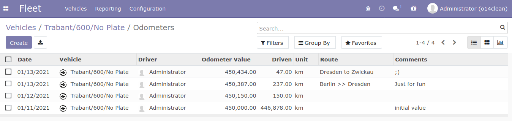

.. image:: https://img.shields.io/badge/licence-AGPL--3-blue.svg
   :target: http://www.gnu.org/licenses/agpl-3.0-standalone.html
   :alt: License: AGPL-3

=====================
Fleet Vehicle Logbook
=====================

NOTE: in the future this module will be moved into ocs/fleet repository.

Usage
=====

In the vehicle > odometers, you will find some new fields:

Known issues / Roadmap
======================

* ...

Bug Tracker
===========

Bugs are tracked on `GitHub Issues
<https://github.com/OCA/fleet/issues>`_. In case of trouble, please
check there if your issue has already been reported. If you spotted it first,
help us smash it by providing detailed and welcomed feedback.

Credits
=======

Images
------

* Odoo Community Association: `Icon <https://github.com/OCA/maintainer-tools/blob/master/template/module/static/description/icon.svg>`_.

Authors
-------

* Maik Derstappen - Derico - <md@derico.de> - MrTango

Funders
-------

The development of this module has been financially supported by:

* cibex.net GmbH

Contributors
------------

* Maik Derstappen <md@derico.de>

Maintainer
----------

.. image:: https://odoo-community.org/logo.png
   :alt: Odoo Community Association
   :target: https://odoo-community.org

This module is maintained by the OCA.

OCA, or the Odoo Community Association, is a nonprofit organization whose
mission is to support the collaborative development of Odoo features and
promote its widespread use.

To contribute to this module, please visit https://odoo-community.org.
